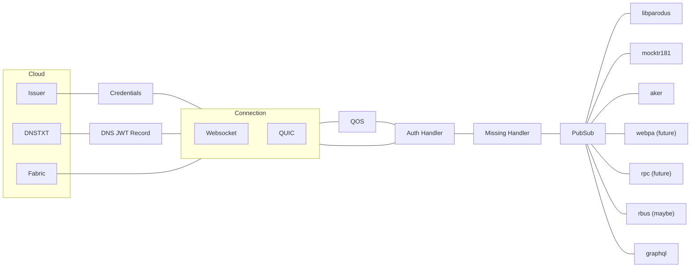

# Client Architecture

The goal of the xmidt-agent is to provide a configurable, flexible and extensible
CPE agent for the xmidt system.  The client is written in golang.

## Prized Objectives

- Separation of concerns
- Configuration
- Sane defaults
- Simplicty
- Fanatical quality
- The Web Routing Packet is the unit of work
- No CGO
- Works with Xmidt Cloud

## General Component Relationships

The general idea is that the agent is broken into a few areas: connection, a chain
of handlers that perform a single behavior, a super simple pubsub component, and
a collection of services that hang off of the pubsub component.

## Why Go?

Go is a simple language that is easy to learn and quickly become productive.  It
is a strongly typed language with an ecosystem second to none to help you build
amazing projects of excellent quality, quickly.

The go tool cross compiles to all possible targets from every supported target.
So developing for an embedded linux environment on a Mac has never been easier.

The resulting binary object basically only depends on the operating system being
present.  No need for OpenSSL, bolted on string libraries, added threading toolkits...
the core language and Standard Library have you covered.

The language strives to help you not make costly mistakes.  One way it does this
is by automatic boundary checking of slices and arrasy.  Another is automatically
zeroing memory.  The garbage collector is so good you don't even notice it.

Goroutines.  They're like threads but 100s of times less expensive.  This means
developers can develop code with many threads and not worry about overloading a
small processor or having a large memory footprint.

All the cloud components are written in go as well, so sharing libraries and
code means better consistency and less surface area to maintain.